# Airfoils

_Navigation_

1. [Startup](startup.md)
2. [Airfoils](airfoils.md)
3. [Wings](wings.md)
4. [Plane](plane.md)
5. [Matlab](matlab.md)

## XFoil Direct Analysis

Once you move into the `File > XFoil Direct Analysis` environment, here you can run the airfoil analysis - always remember to do that before stepping in the `Wing and Plane Design`.

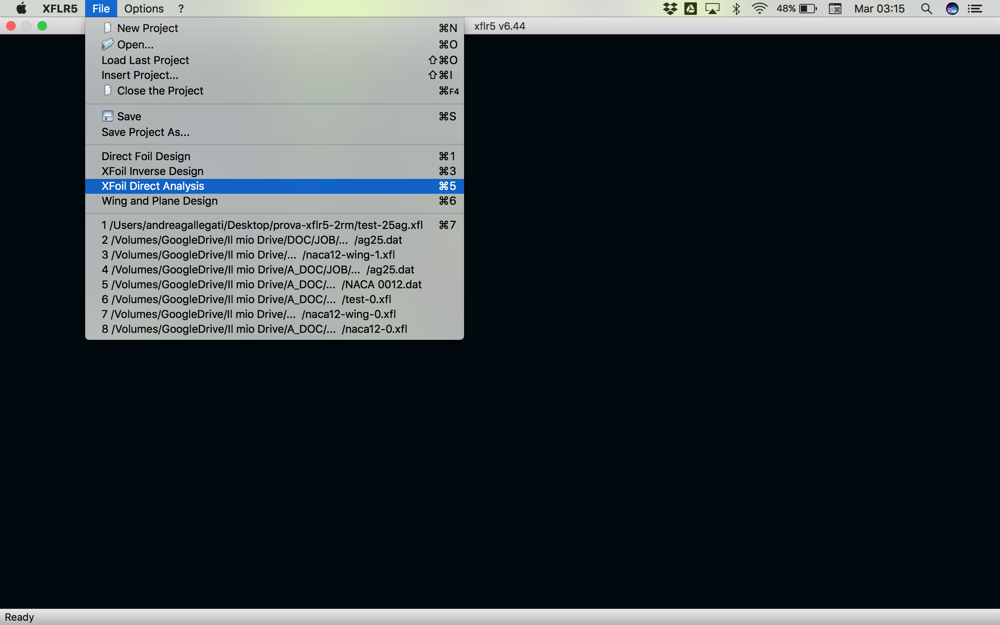

## Naca Foils

Here actually, clicking on the dropdown menu `Design > Naca Foils`, we would have a straightforward way to directly select some standard airfoils - in particular one among the [NACA airfoils](https://en.wikipedia.org/wiki/NACA_airfoil) collection - providing for the series of **four digits** following the word "NACA".

This numerical code contains four parameters that can be entered into equations to precisely generate the cross-section of the airfoil and calculate its properties (i.e. the maximum camber, its distance from the leading edge and the maximum thickness, everything as a fraction of the chord).

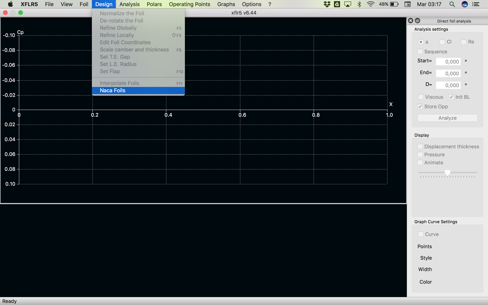

here for instance we chose - for historical reasons - the NACA 0012 airfoil that is a very simple one, being symmetrical as the leading zeros should suggest

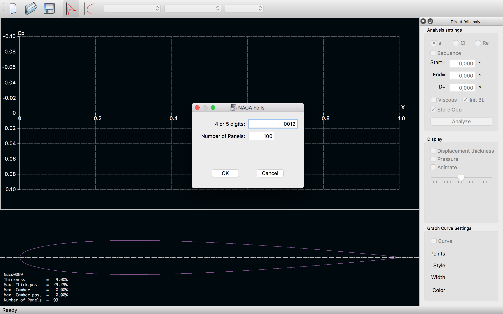

just enter and save the airfoil, as you would have saved any other airfoil found in any database or drawn by you.

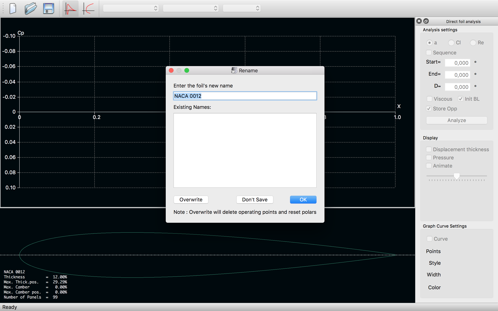

## Define an Analysis

Now it's time to setup an anlysis to retrieve some output to post-process later on, being this the typical workflow when dealing with numerical simulations in fluid dynamics and physics, in general.

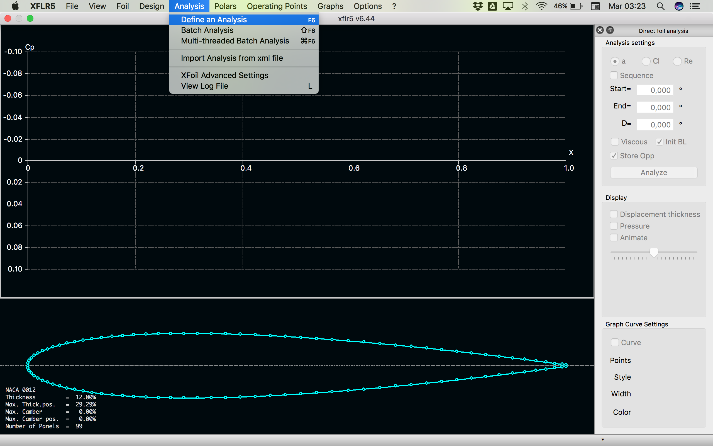

Click on the dropdown menu `Analysis > Define an Analysis`and for this test case leave everything unchaged (all the parameters are set to default values).

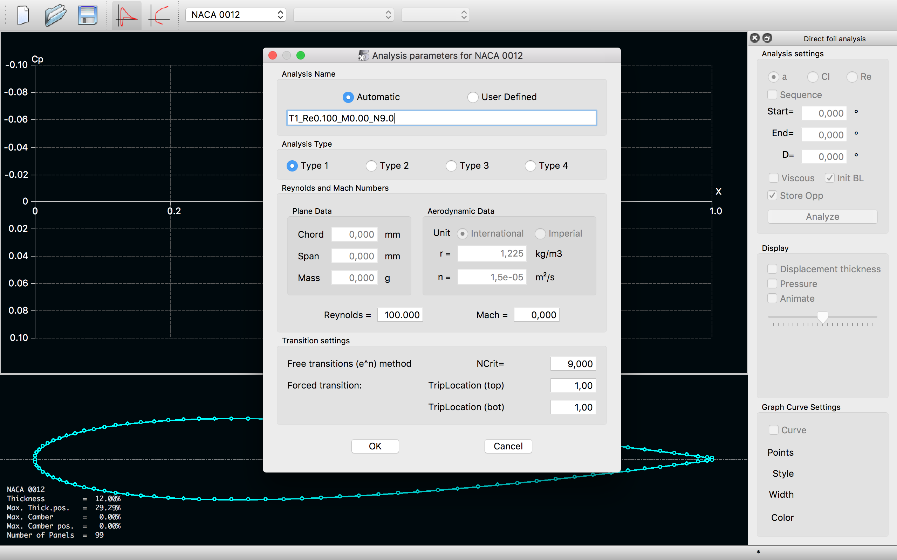

This will enable, on the right side of your screen, the `Direct foil analysis` window, with the buttons to configure the angle of attack `Sequence`.

Do not forget to **uncheck** the `Viscous` and `Init BL` boxes (we don't need any viscous correction) and above all to **check** the `Store Opp` one. If not, the analysis is processed by the solver, but later discarded!

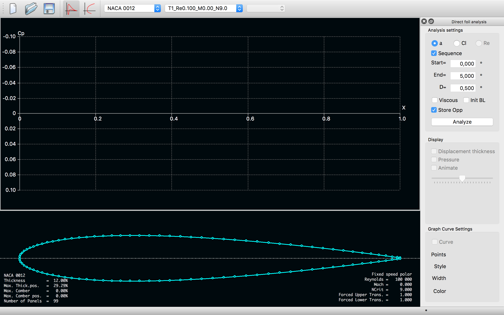

Click on the `Analyze` button to launch the analysis, on the given profile, for the provided angle of attack sequence. A console should (briefly) appear on your screen, showing the analysis log. This is something you might need to check if anything goes bad (we hope not!). 

If everything works, the pressure distribution (Cp) should appear on your screen. From the same window - as you can see at the top of the screen here below - you can display the different results you carried out running the analysis on another airfoil, at different flight conditions (changing the anlysis parameters) or just varying the angle of attack within the `Sequence` prescribed.

Sometimes it happens that the pressure distribution is not automatically plotted. If this is the case, try to right-click on the region where the Cp distribution were supposed to appear and check the `Cp Graph > Show Inviscid Curve` box.

As you can see from the screenshot here below, from the same dropdown menu you can also switch to the velocity distribution on the airfoil only checking the `Cp Graph > Q Variable` box.

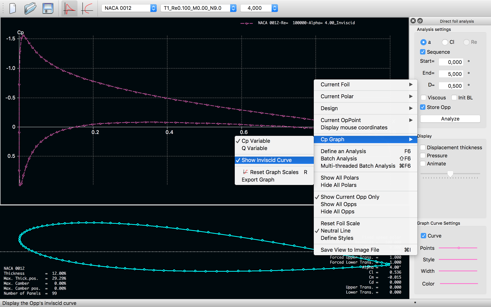

## Export data

If you ran an analysis using an airfoil you did not upload from the `xflr5-pp/airfoil/data/` directory, remember to save it clicking on `Current Foil > Export...` into that directory (always right-clicking to open the dropdown menu). 

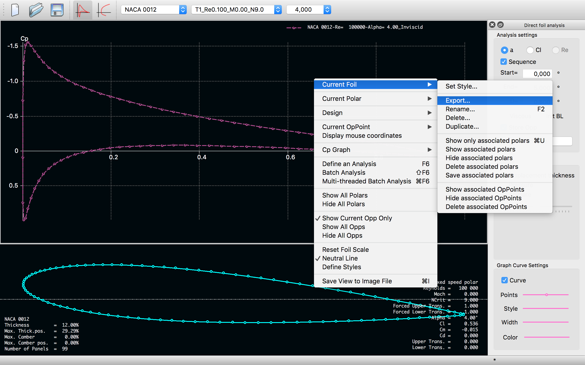

To export the pressure distribution (Cp) and the velocity on the airfoil, click on `Current OpPoint > Export`.

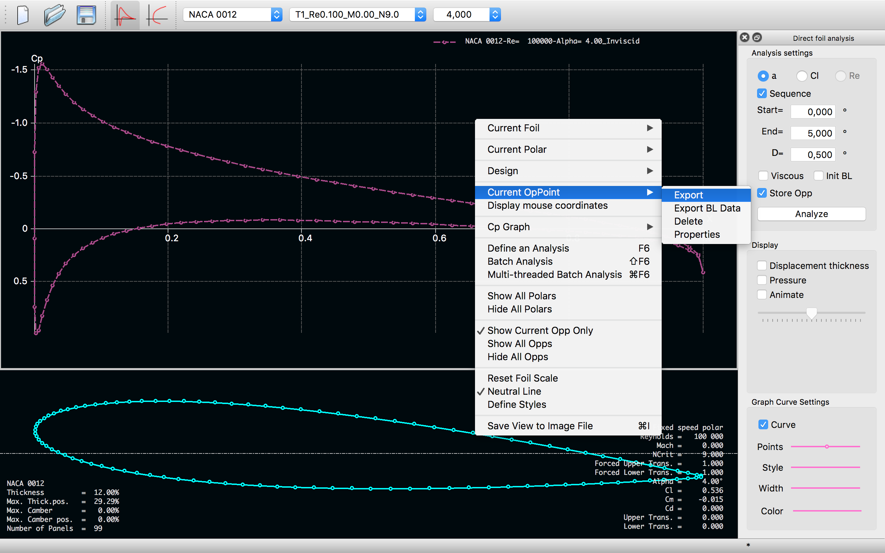

Save the data on the same `xflr5-pp/airfoil/data/` directory, as shown, chosing appropriate names:
1. for the sake of clarity - it is always better to help someone else reading your code (since this one could be you)
2. to be consistent with the `paths` provided in your post-processing scripts, e.g. the `filename` in [`plot_airfoil_cp.m`](/xflr5-pp/airfoil/plot_airfoil_cp.m)

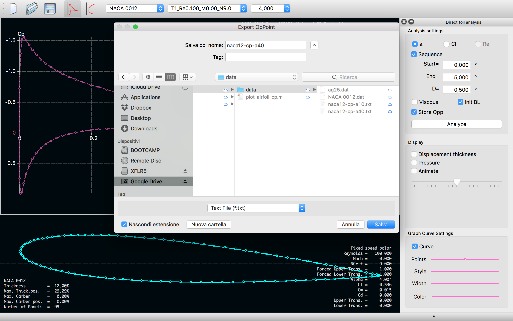

If you would like to post-process these data - for example using `matlab` - [jump here](matlab.md) to have a brief survey on how to run the [`plot_airfoil_cp.m`](/xflr5-pp/airfoil/plot_airfoil_cp.m) matlab script here provided, for example.
