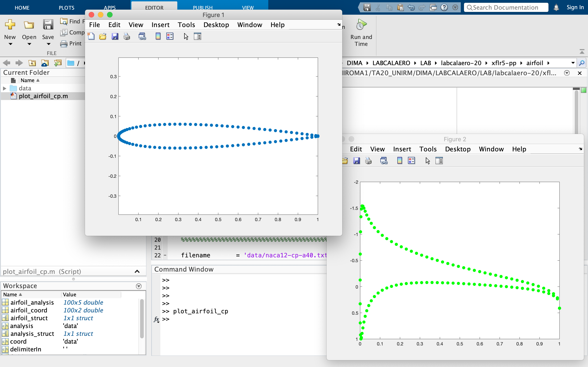

# Matlab

_Navigation_

1. [Startup](startup.md)
2. [Airfoils](airfoils.md)
3. [Wings](wings.md)
4. [Plane](plane.md)
5. [Matlab](matlab.md)

## Matlab post processing

What follows, here below, is a very simple demo of how to post-process an `xflr5` simulation - in matlab - after exporting the available output data. In particular, launching the [`plot_airfoil_cp.m`](/xflr5-pp/airfoil/plot_airfoil_cp.m) matlab script, we are going to plot the airfoil cross-section and the pressure distribution (Cp) we already discussed in a previous [section](airfoils.md).

This example has been run using `MATLAB_R2019b`, but it has proven backward compatibility (at least) up to the older version `MATLAB_R2014a`. Please report any issue writing [here](mailto:andrea.gallegati@uniroma1.it).

Starting from the airfoil analysis, once you exported the pressure distribution (Cp) following [these instructions](airfoils.md), run `matlab` on you machine.

Look at the top of the screenshot here below, it is very important to move from the default `MATLAB` [Startup Folder](https://www.mathworks.com/help/matlab/matlab_env/matlab-startup-folder.html) to the directory where your cloned this repo, giving `matlab` the full path to the [`plot_airfoil_cp.m`](/xflr5-pp/airfoil/plot_airfoil_cp.m) matlab script. 

Now you can understand why it is so important to export the output data in the right `xflr5-pp/airfoil/data/` directory.

Look at the `Current Folder` window - on the left of the screenshot - here we have evrything we need! In the same directory there are both the [`plot_airfoil_cp.m`](/xflr5-pp/airfoil/plot_airfoil_cp.m) matlab script and (next to it) the `xflr5-pp/airfoil/data/` directory.

We are almost ready to run our matlab script, just click on the [`plot_airfoil_cp.m`](/xflr5-pp/airfoil/plot_airfoil_cp.m) file listed within the `Current Folder` window - always on the left - to open it on the `Editor` window (at the center) where you can scroll it up and down.

Before running this script remember to edit it - changing the `filename` to `'data/naca12-cp-a10.txt'` as shown here above - just to give the script the relative path to the data exported for an *angle of attack* of 4°. This will allow us to compare, what this matlab script will output, against what we were able to visualize within `xflr5` in a previous [section](airfoils.md).

Now it's time to run our [`plot_airfoil_cp.m`](/xflr5-pp/airfoil/plot_airfoil_cp.m) program hitting the `Run` button - on the top of the `matlab` GUI here above - or just typing `plot_airfoil_cp` in the `Command Window` as shown above. In the latter case remember to hit enter! :wink:

Couple of windows should pop up at a certain point, showing the two figures we were asking for to our program, as you can see here above. If you plotted the Cp distribution at an *angle of attack* of 4° you shold end up with something very similar to the plot shown here below - we already came across in a previous [section](airfoils.md) - within the `xflr5` GUI.

Now it's really time - for you - to dive into the [`plot_airfoil_cp.m`](/xflr5-pp/airfoil/plot_airfoil_cp.m) matlab script, for example to better understand how functions as [`importdata`](https://www.mathworks.com/help/matlab/ref/importdata.html) or [`fieldnames`](https://www.mathworks.com/help/matlab/ref/fieldnames.html#mw_02c445a2-9807-4a4f-a1a2-e21705ebbea9) actually work and what a [`struct`](https://www.mathworks.com/help/matlab/ref/struct.html) is in `matlab`.

What this very simple demo shows us is (only) that the above functions do their job on retrieving the data we exported from `xflr5` - once we ran the analysis on it - since their output (the two plots) are basically the same.

Comparing the first half against the second one, of the [`plot_airfoil_cp.m`](/xflr5-pp/airfoil/plot_airfoil_cp.m) matlab script here above, can you figure out a way to combine together their features to get the resultant of the Cp distribution along the direction perpendicular (lift) and parallel (drag) to the free-stream velocity, for each value of the *angle of attack*?

Would it be that hard to wrap everything within a `for` loop in order to have the CL and CD at each value of &alpha; - the *angle of attack* - and thus to plot for example CL vs &alpha; ?
