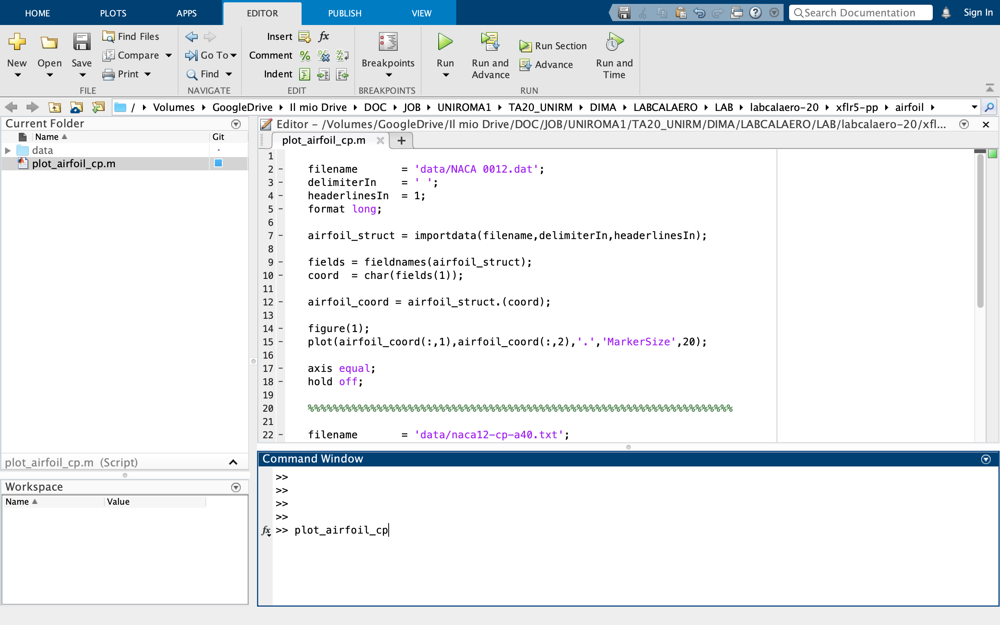

# Matlab

_Navigation_

1. [Startup](startup.md)
2. [Airfoils](airfoils.md)
3. [Wings](wings.md)
4. [Plane](plane.md)
5. [Matlab](matlab.md)

## Matlab post processing

What follows, here below, is a very simple demo of how to post-process an `xflr5` simulation - in matlab - after exporting the available output data. In particular, we are going to plot the airfoil cross-section and the pressure distribution (Cp) we already discussed in a previous [section](airfoils.md).

This examples has been run using `MATLAB_R2019b`, but it has proven backward compatibility (at least) up to the older version `MATLAB_R2014a`. Please, otherwise, report any inconsistency here below.

Starting from the airfoil analysis, once you exported the pressure distribution (Cp) following [these instructions](airfoils.md), run `matlab` on you machine. 

