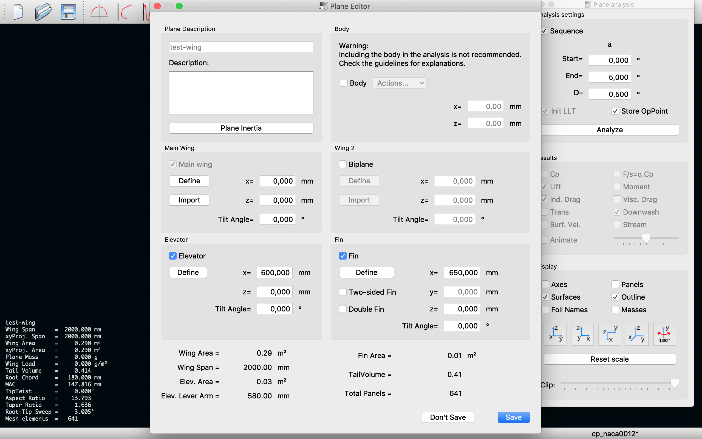
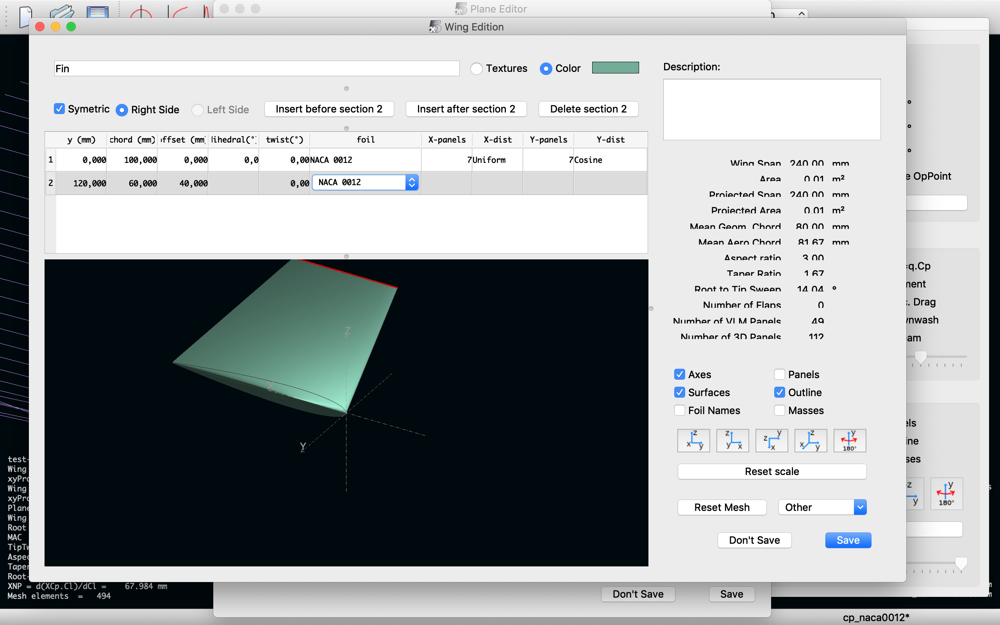
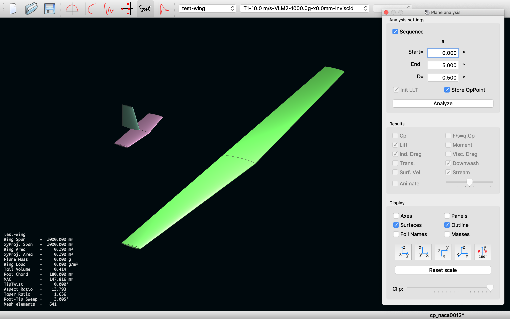

# Plane

_Navigation_

1. [Startup](startup.md)
2. [Airfoils](airfoils.md)
3. [Wings](wings.md)
4. [Plane](plane.md)
5. [Matlab](matlab.md)

## Wing and Plane Design

Following the preliminary steps given within the [previous section](wing.md), to design a wing - along with the instructions to run an analysis - in the `File > Wing and Plane Design` environment, it is now possible to design a whole plane.

Once the `Main wing` has been defined, it is possible to add some other elements to build a wing system - clicking on the `Plane > Current Plane > Edit` - such as an `Elevator` or a `Fin`, **checking** the corresponding boxes, as shown below.

Then click on the corresponding `Define` buttons to design for example the `Elevator` on the `Wing Edition` window.

The same applies to the `Fin` setting up all the necessary geometrical parameters, as usual.

Then click on the `Save` button to setup each element of the wing system and to save the whole plane. 

As you can see from the `Plane Editor` window it would be possible to define a body too, although it is recommended not to include it in the analysis, since `xflr5` do not employ the `Ring vortex (VLM2)` method on blunt bodies. Thus, it would be meaningless for us to mix up things in this Lab.

## Examples

What follows here below is just a collection of successful wing systems design and analyses (you can find in this directory `xflr5-pp/plane/project/`), carried out following the instructions given in this quick guide and in particular within this closing section.

I hope you will get inspired looking at some of them.

### F1 rear wing

Here following, it is shown the [Drag Reduction System](https://en.wikipedia.org/wiki/Drag_reduction_system) (DRS) in closed (top) and open (bottom) positions.

###  X-wing starfighters

Here following, it is shown the analysis around an [X-wing fighter](https://en.wikipedia.org/wiki/X-wing_fighter), a fictional spacecraft from *Star Wars*.

