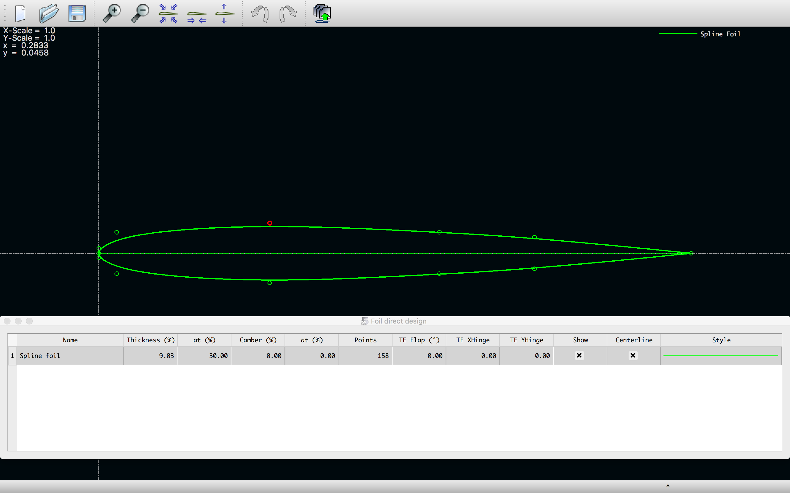

# Startup

_Navigation_

1. [Startup](startup.md)
2. [Airfoils](airfoils.md)
3. [Wings](wings.md)
4. [Plane](plane.md)
5. [Matlab](matlab.md)

## Welcome to xflr5

XFLR5 is an analysis tool for airfoils, wings and planes operating at low Reynolds Numbers. It includes:

1. XFoil's Direct and Inverse analysis capabilities
2. Wing design and analysis capabilities based on the Lifiting Line Theory, on the Vortex Lattice Method, and on a 3D Panel Method

to learn more about this amazing project, go to the following web page: <http://www.xflr5.tech/xflr5.htm> where you can find additional material, support and in general informations about any update for this nice program.

What follows, here below, is a coincise hands-on guide to run your first simulation - using xflr5 - on your machine, starting from the airfoil design/analysis up to the simulation of an entire wings system accounting for all the finite wing phenomena. This tutorial will be mainly made of screenshots guiding you through this wonderful GUI, here in its macOS version, but it should look very similar on the other platforms.

This example has been run using `xflr5_6.44_macOSX` version. Please report any issue writing [here](andrea.gallegati@uniroma1.it).

## Running xflr5

Once you download the latest version of xflr5 (going here <https://sourceforge.net/projects/xflr5/files/>) just navigate the directory tree untill you find the executable file - with the xflr5 icon - and launch it!

A black screen should appear. Don't panic! everything's fine. Although it seems that something very bad happened, it is not.

You just have to open the dropdown menu, clicking on `File` and select the environment you want to move in. For this introduction, for example we will just need to go to the `File > Direct Foil Design` environment, but for the next sections we will move to `File > XFoil Direct Analysis` or `File > Wing and Plane Design`.

Looking at the previous screenshot, you can see that instead of creating a whole new project, from the same dropdown menu it was possible to load a previously saved state (project). Thus, always remember to save your current work (project) before exiting and closing xflr5.

## Direct Foil Design

Into the `Direct Foil Design` environment it is possible to draw a new airfoil - just moving the control points through which a spline is interpolated - starting from the scratch. It is also possibe to load already existing airfoils, you may find in any database, or just loading one of the airfoils provided in the `xflr5-pp/airfoil/data/` directory.

Here below, for example, we uploaded the `ag25.dat` airfoil (Drela AG25 airfoil used on the Bubble Dancer R/C DLG) that you can find on this online database: <https://m-selig.ae.illinois.edu/ads/coord_database.html>

Now you are ready to step into the [Airfoils](airfoils.md) analysis clicking in the dropdown menu on `File > XFoil Direct Analysis`.
