# Wings

_Navigation_

1. [Startup](startup.md)
2. [Airfoils](airfoils.md)
3. [Wings](wings.md)
4. [Plane](plane.md)
5. [Matlab](matlab.md)

## Wing and Plane Design

Following the preliminary steps given within the [previous section](airfoils.md), concerning the airfoil design - along with the instructions to run an analysis - in the `File > XFoil Direct Analysis` environment, it is now possible to design a plane (or at least a wing system) starting from the main wing design.

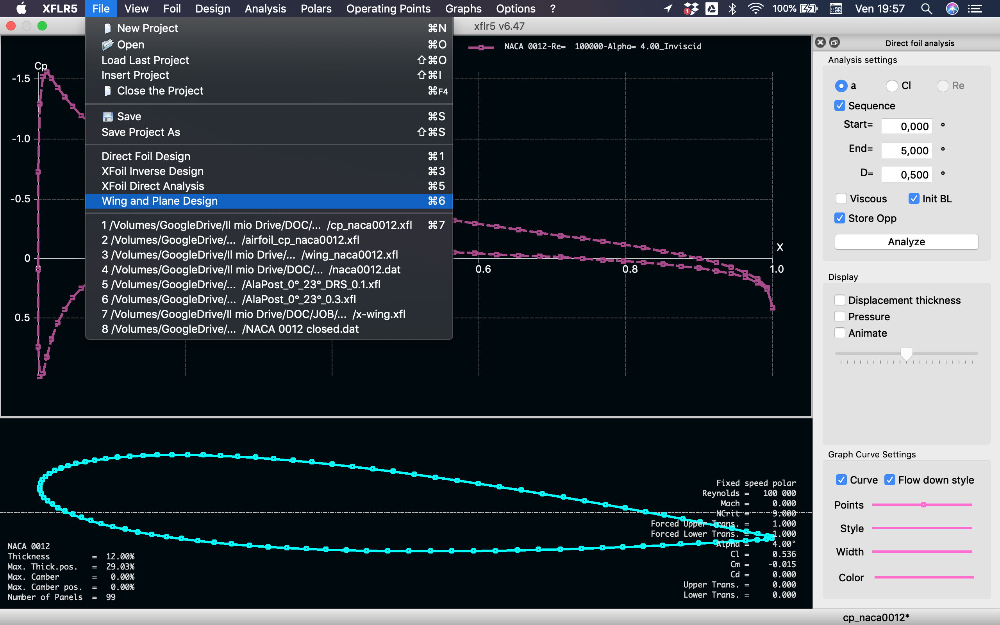

Once inside the `File > Wing and Plane Design` go directly to the `Plane Editor` window clicking on the dropdown menu `Plane > Design a New Plane`, first to design - at least at this stage - just the `Main wing`.

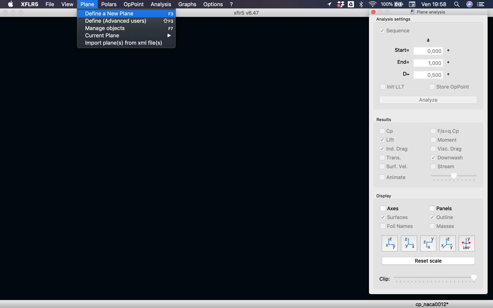

Remeber to **uncheck** everything, but the (default) `Main wing` box. We will see in the [next section](plane.md) how to setup a more complex wing system, made of an `Elevator`, `Fin`, eventually a `Body` and moreover how the `Biplane` feature reveals to be an effective expedient to account for the [*ground effect*](https://en.wikipedia.org/wiki/Ground_effect_(aerodynamics)), mimicking in a trivial way the so called [*method of images*](https://en.wikipedia.org/wiki/Method_of_image_charges).

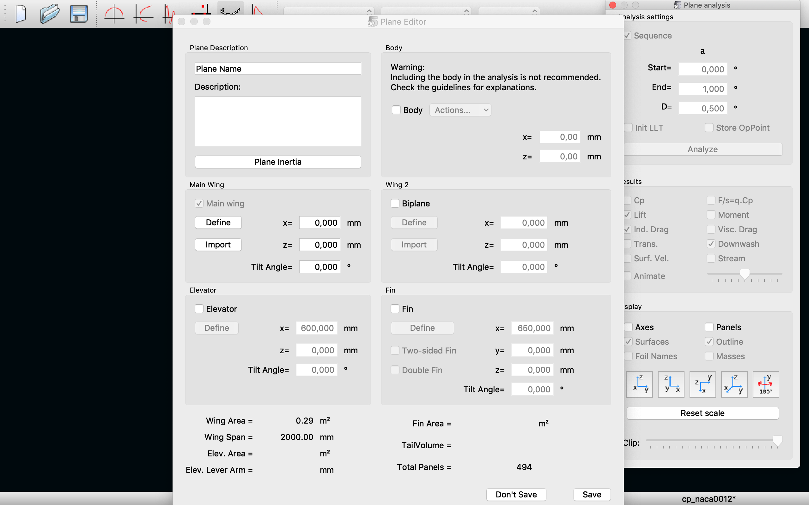

In the `Wing Edition` window, you will be allowed *tailoring* your wing setting up any geometrical parameter (the wingspan `y`, the `chord`, `offset`, `dihedral` angle, `twist` angle, the section `foil`) defining as many `sections` as you want to make these parameters changing too.

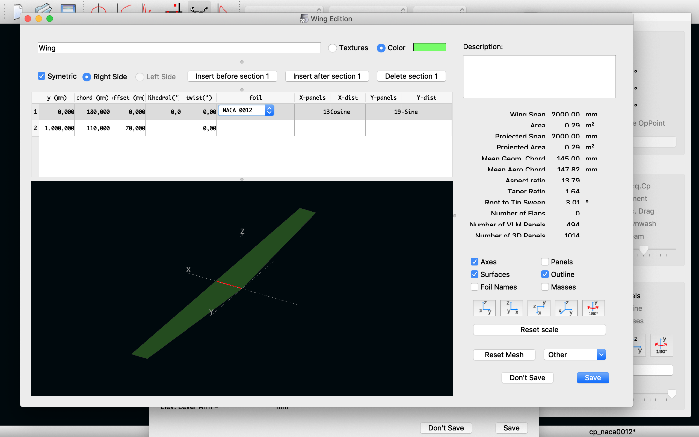

To start it is also possible to leave everything unchanged, but in this case do not forget to chose at least one `foil` - among the ones made available in the [previous section](airfoils.md) - for both `sections` (the wing root/tip).

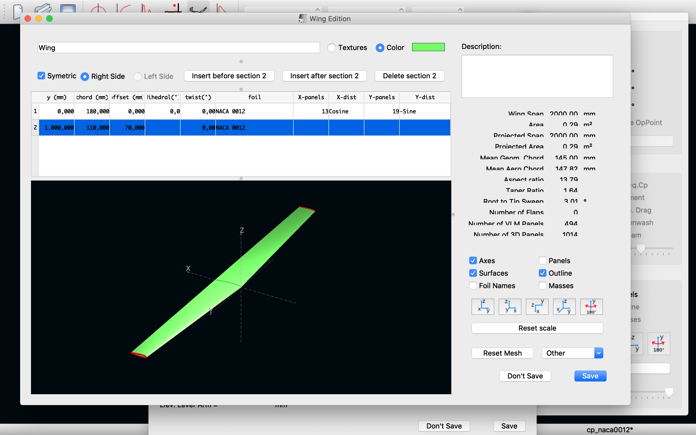

Once a particular `foil` has been chosen for each section - **checking** the `Surfaces` box on the right column - the nonzero thickness three-dimensional wing will be highlighted. Just click on the `Save` button in the lower right corner.

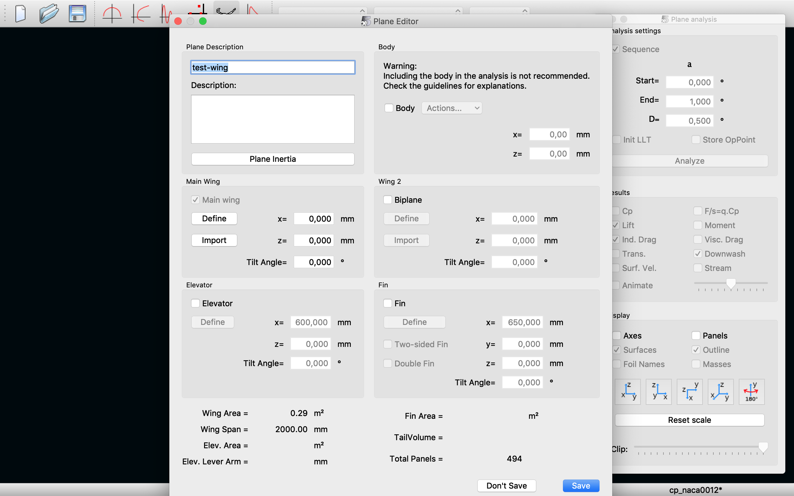

After the `Main wing` has been saved - back in the `Plane Editor` window - you can change the `Plane Description` name just before saving it, again clicking on the `Save` button in the lower right corner here above.

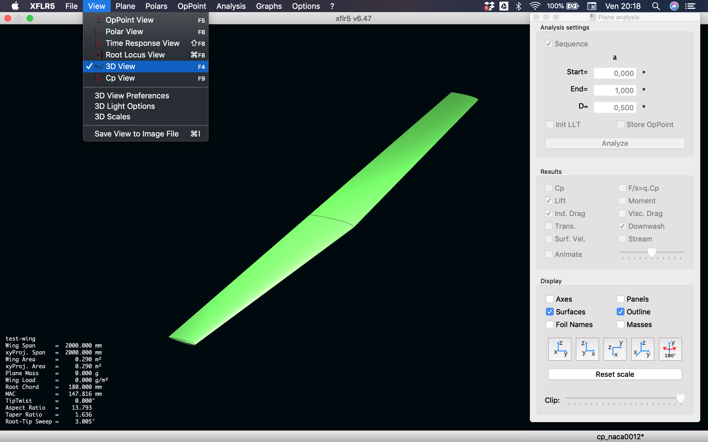

Just in case no wing is appearing on of your screen: click on the `View > 3D View` dropdown menu, as shown here above.

## Define an Analysis

To set up your analysis click on `Analysis > Define an Analysis` to open the `Analysis Definition` window, here below.

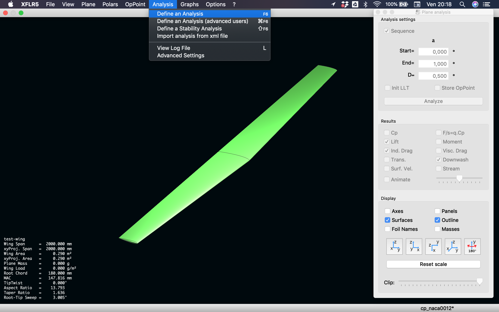

Here for example, you can change the `Auto Analysis Name`, if you are running different analyses at the same time. 

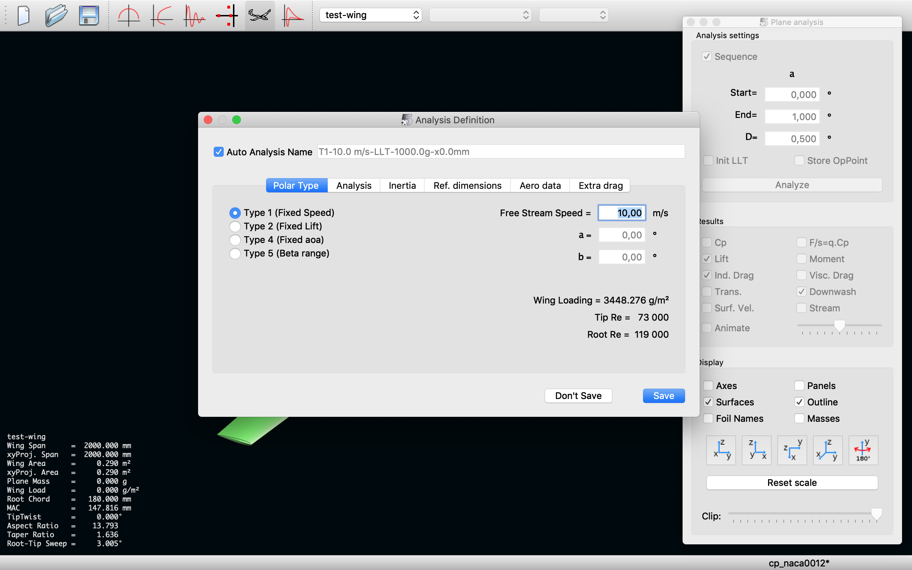

However the most important sections to pay attention for are:
* the `Polar Type` (here above), depending on the parameter you want to keep constant while varying some others. For our purposes `Type 1 (Fixed Speed)` is fine - as it is the *Free Stream Speed* equal to `10 m/s` - since we will be varying instead the *Angle of Attack* (*aoa*).
* the `Analysis` (here below), to choose among the `Analysis Method` here proposed. Since we are just dealing with the *Vortex Lattice Methods* (VLM), within this Lab there are two options, but the `Ring vortex (VLM2)` one is preferable allowing for some [*sideslip*](https://en.wikipedia.org/wiki/Slip_(aerodynamics)). Remember then to **uncheck** the `Viscous` option box

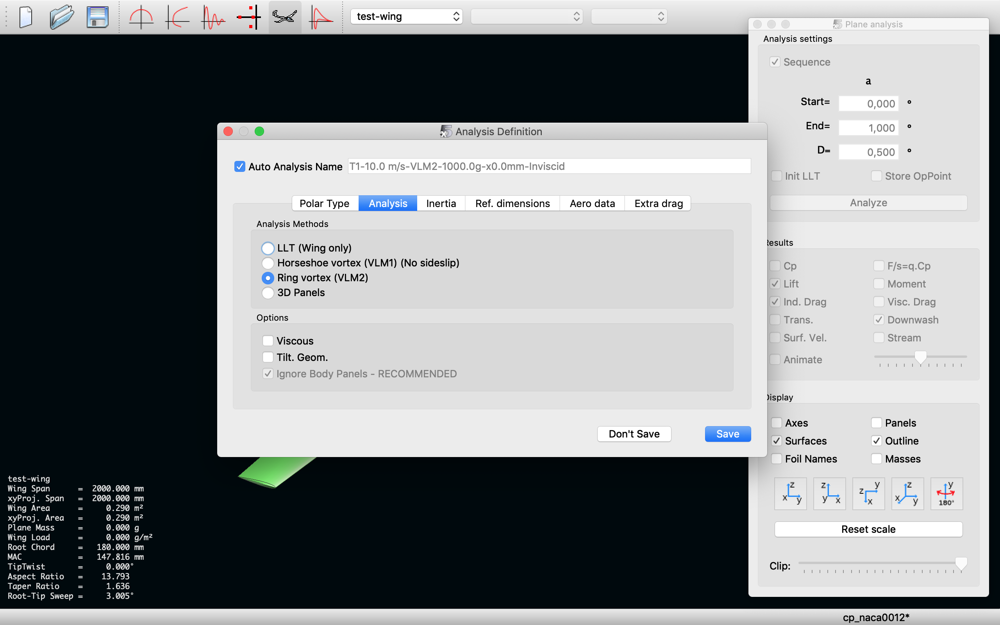

This will enable, on the right side of your screen, the `Plane analysis` window, with the buttons to configure the angle of attack `Sequence`. Do not forget to **check** the `Store Opp` box, not to discard the analysis processed by the solver. 

If the `Plane analysis` window is not there, click `Options > Restore toolbars` to make it appearing.

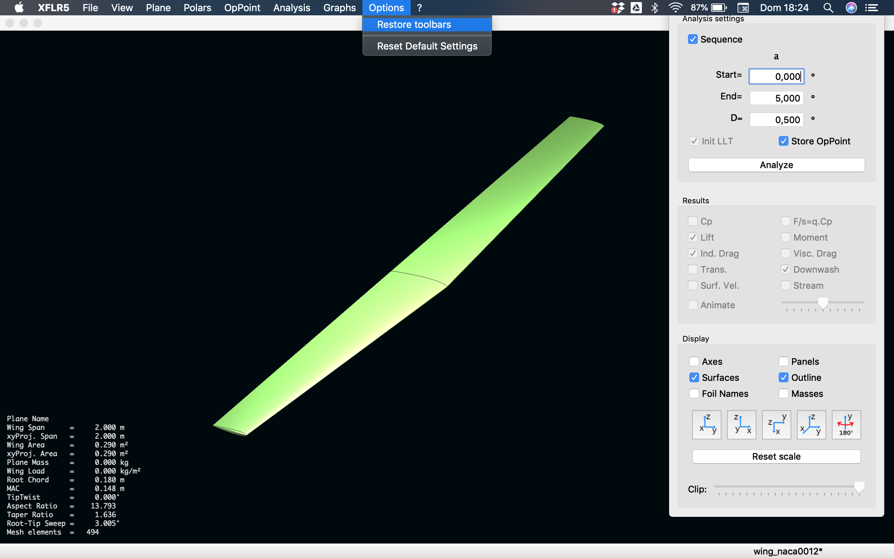

Click on the Analyze button to launch the analysis, on the given wing, for the provided angle of attack `Sequence`.

A console should (briefly) appear on your screen, showing the analysis log. This is something you might need to check if anything goes bad (we hope not!).

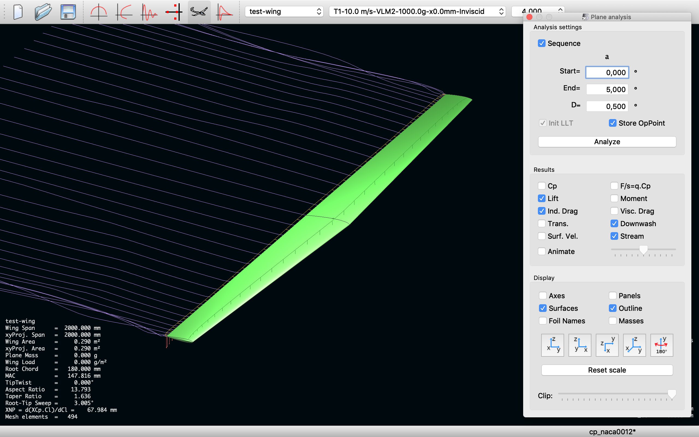

**Check** the `Lift`, `Ind. Drag` and `Downwash` boxes - for example - and some plots should appear on your wing. 

From the same window - as you can see at the top of the screen here above - you can display the different results you carried out running the analysis on other wings, at different flight conditions (changing the anlysis setup) or just varying the *aoa* within the prescribed `Sequence`.

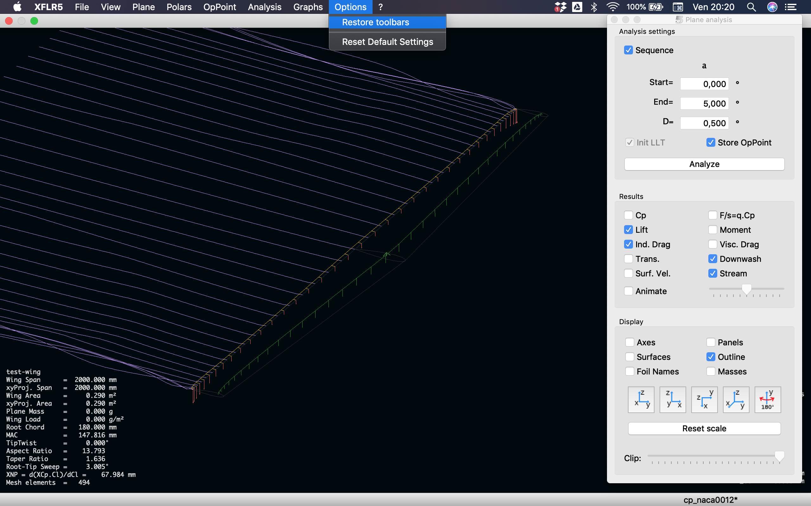

Try to **uncheck** the `Surfaces` box, not to hide these plots with the wing itself, as shown here above. **Check** the `Stream` box to get a glimpse of how the streamlines look like!

At any moment it is possible to make any change on your wing - clicking on the `Plane > Current Plane > Edit` dropdown menu as shown here below - running then a new analysis on it.

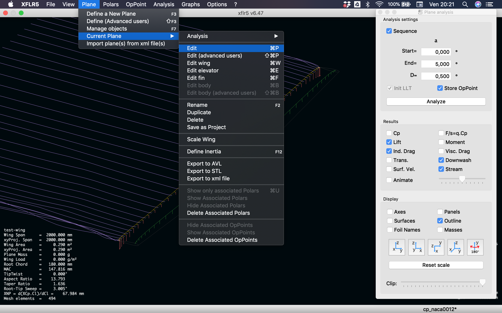

One could refine the *Lattice mesh* changing the `Panels` number along each direction (`X-panels` and `Y-panels` entries) or their distribution (`X-dist` and `Y-dist`). Be sure to **check** the `Panels` box on the right, in order to make it visible any change you just made and to save it, clicking on the `Save` button in the lower right corner.

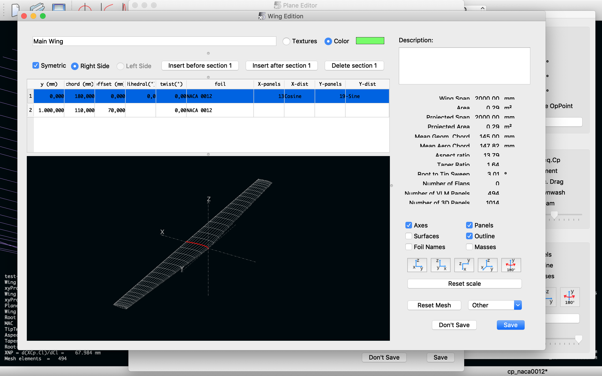

Once you define the  `Main wing` you can keep going designing a whole plane - or at least a wing system - following the instructions within the [next section](plane.md).

## Export data

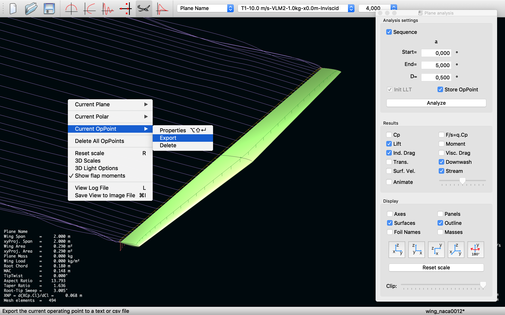

To export the analysis results - at a given *aoa* - such that the pressure distribution (Cp) on each panel or the reluting CL and CD over each chord-wise *strip*, save them clicking on `Current OpPoint > Export` (always right-clicking to open the dropdown menu). 

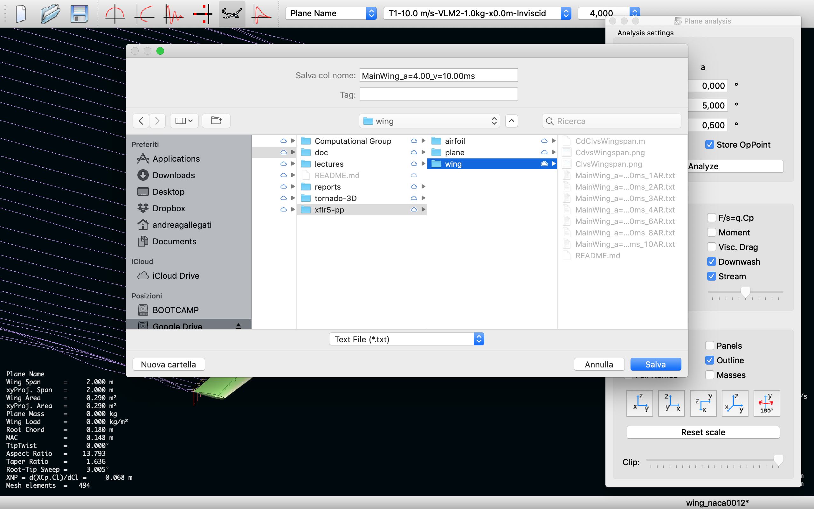

Save the data within the same `xflr5-pp/wing/` directory as shown above, chosing as usual appropriate names; especially to be consistent with the `paths` provided in your post-processing scripts (e.g. the `filename`). If you would like to post-process these data - for example using `matlab` - have a look at the [`CdClvsWingspan.m`](/xflr5-pp/wing/CdClvsWingspan.m) matlab script here provided.

