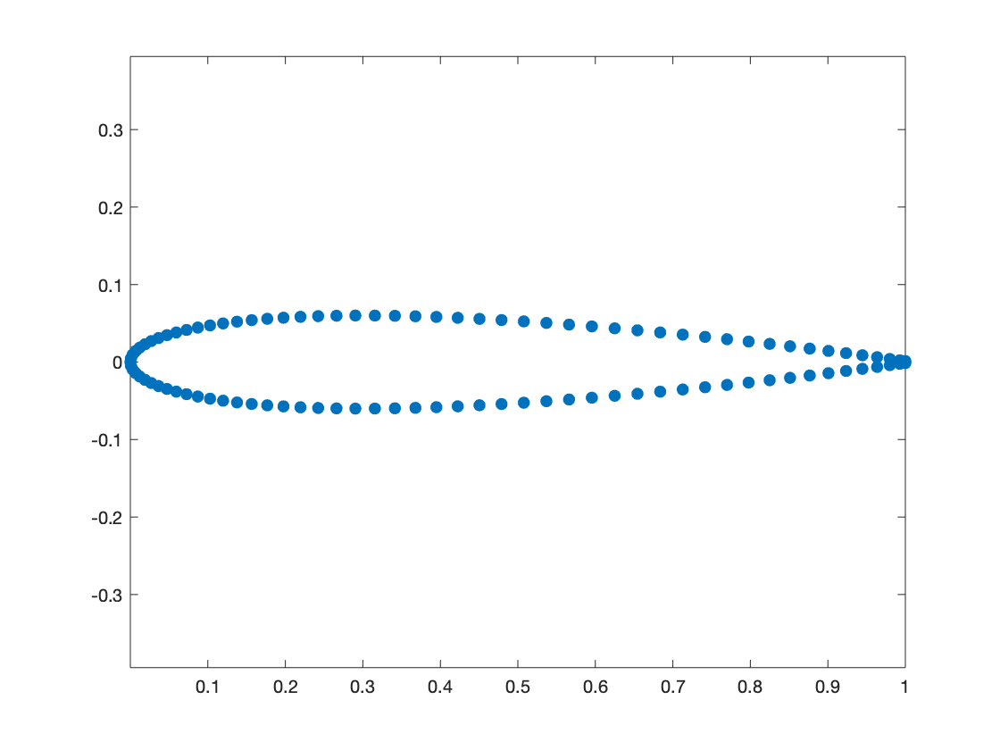
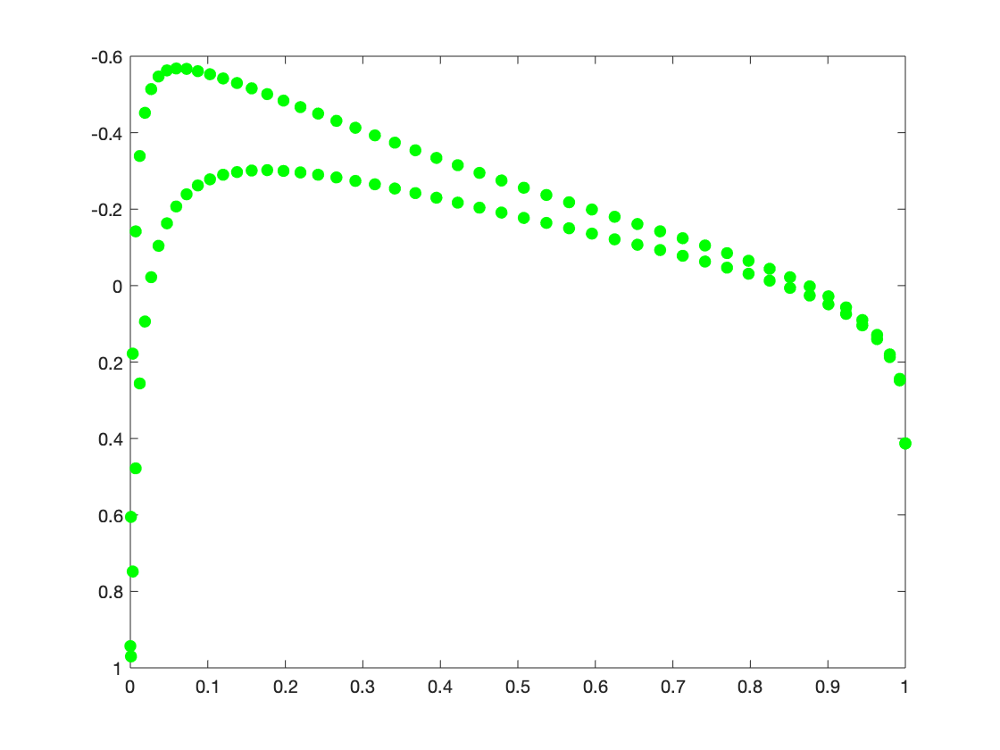
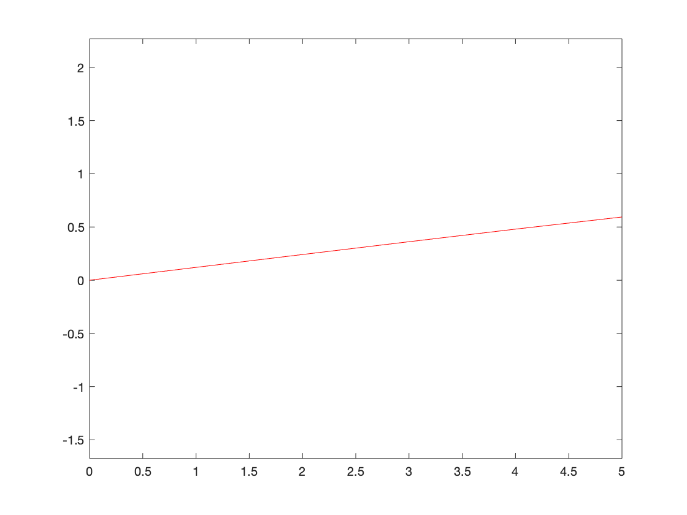

# README.md

Launching the [`plot_airfoil_cp.m`](/xflr5-pp/wing/plot_airfoil_cp.m) matlab script, the sample output should look like the ones following: 

while launching the [`plot_airfoil_cl.m`](/xflr5-pp/wing/plot_airfoil_cl.m) matlab script, it should look like the one, here below: 

